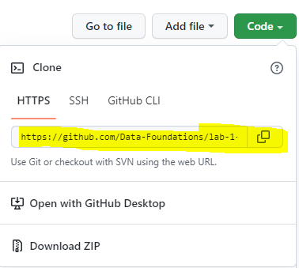
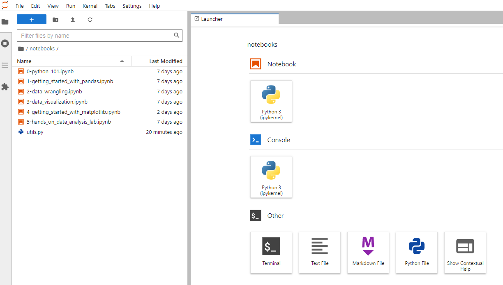

# Data Foundations Labs 

Welcome to the first lab of the Data Foundations course.

Python is increasingly becoming the standard programming language for data applications and we will also use python during the labs. Prior knowledge of python is not required but it can help. We start with a short python crash course to get you up to speed. We use [jupyter notebooks](https://jupyter.org/) which is a popular intuitive tool that is well suited to experiment and develop python code. 

We will use Github Classroom to distribute the labs. This will also be used to evaluate your work. Make sure to push your work to the repo before the deadline!

Below you can find step-by-step instructions on how to get started with the first lab.

# Setup Instructions

### 1. Install Miniconda or Anaconda
We will use conda to manage the necesary python libraries for the lab. If you don't have Miniconda or Anaconda on your device install the latest version of [Miniconda](https://docs.conda.io/en/latest/miniconda.html).   

### 2. Clone the repo to your VM

In the Github Classroom repo click on Code and copy the link to clone the repository (see [Github Docs](https://docs.github.com/en/repositories/creating-and-managing-repositories/cloning-a-repository) if you need a reminder on cloning a repo). 

   
    

### 3. Create a virtual environment and launch Jupyterlab

1. Open a terminal, go to the main pandas folder and create and activate a virtual environment: 
```shell
(base) ~$ cd pandas 
(base) ~/pandas$ conda env create --file environment.yml
(base) ~/pandas$ conda activate DF-lab-1
(DF-lab-1) ~/pandas$
```

2. Launch jupyter lab in your browser:
```shell
(DF-lab-1) ~/pandas$ jupyter lab
```

3. Navigate to the `notebooks` folder and open a notebook by double clicking on it.

    
    
---


# Lab 1: Pandas and Matplotlib

Working with data can be challenging: it often doesn’t come in the best format for analysis, and understanding it well enough to extract insights requires both time and the skills to filter, aggregate, reshape, and visualize it. This session will equip you with the knowledge you need to effectively use pandas – a powerful library for data analysis in Python – to make this process easier.

Pandas makes it possible to work with tabular data and perform all parts of the analysis from collection and manipulation through aggregation and visualization. While most of this session focuses on pandas, during our discussion of visualization, we will also introduce at a high level Matplotlib (the library that pandas uses for its visualization features, which when used directly makes it possible to create custom layouts, add annotations, etc.) and Seaborn (another plotting library, which features additional plot types and the ability to visualize long-format data).

Once you have finished the Setup instructions you can start with the lab exercices. At the end of each section there are exercices and the final section is a lab exercice. Make sure to make the exercices and commit your notebooks to Github Classroom before the deadline. 

The material for this lab is based on a [workshop on Pandas](https://github.com/stefmolin/pandas-workshop) and a [workshop on data visualization](https://github.com/stefmolin/python-data-viz-workshop) by Stefanie Molin ([@stefmolin](https://github.com/stefmolin)).

## outline

The lab is divided into the following sections:

### Section 0: Python 101
We start with a crash course on python. A more in depth tutorial can be found [here](https://docs.python.org/3/tutorial/)

### Section 1: Getting Started With Pandas
We will begin by introducing the `Series`, `DataFrame`, and `Index` classes, which are the basic building blocks of the pandas library, and showing how to work with them. By the end of this section, you will be able to create DataFrames and perform operations on them to inspect and filter the data.

### Section 2: Data Wrangling
To prepare our data for analysis, we need to perform data wrangling. In this section, we will learn how to clean and reformat data (e.g., renaming columns and fixing data type mismatches), restructure/reshape it, and enrich it (e.g., discretizing columns, calculating aggregations, and combining data sources).

### Section 3: Data Visualization
The human brain excels at finding patterns in visual representations of the data; so in this section, we will learn how to visualize data using pandas along with the Matplotlib and Seaborn libraries for additional features. We will create a variety of visualizations that will help us better understand our data.

### Section 4: Getting Started With Matplotlib
We will familiarize ourselves with Matplotlib. Moving beyond the default options, we will explore how to customize various aspects of our visualizations. By the end of this section, you will be able to generate plots using the Matplotlib API directly, as well as customize the plots that libraries like pandas and Seaborn create for you.

### Section 5: Hands-On Data Analysis Lab
We will practice all that you’ve learned in a hands-on lab. This section features a set of analysis tasks that provide opportunities to apply the material from the previous sections.

